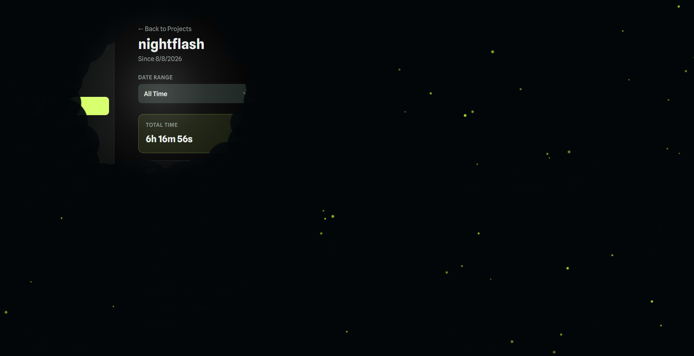

# Night Flash

A fun little chromium extension which creates night time vibes with night fog. And your cursor acts as a flash. With some fireflies for the vibess. It also has pop up menu with which you can disable it, change torch size, torch/light temperature and edit the number of fireflies you want in the screen (don't go overboard, it might lag).

## some cool things:
* ### Shortcut keys:
    * ctrl + shift + f -> quick enable/disable
    * ctrl + shift + 1/2/3 -> quick torch size change
    * ctrl + shift + alt + 1/2/3 -> quick torch temperature change

* ### fireflies:
    Normally fireflies will wander around in random directions but near the light, it try to move away from it.

* ### night fog:
    It will eat up the space when you leave.

* ### sleep timer:
    After 2 minutes of inactivity, the light will start to dim and flicker than after some seconds, it will go off.

